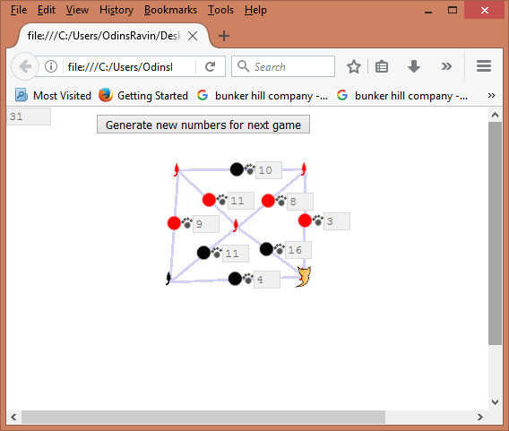
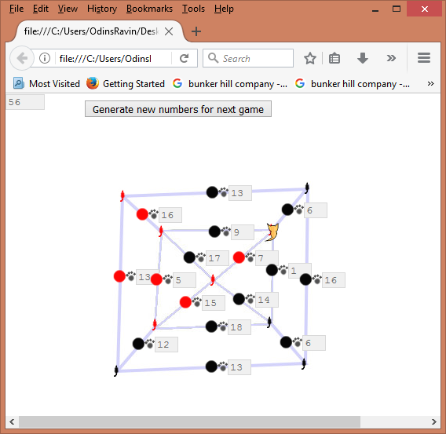
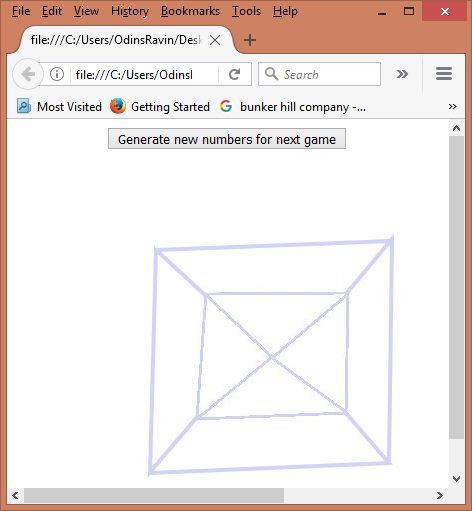

This is Travelling Cat a game based on the travelling salesman problem. Travel around the map and eat all the mice, eating the mouse where you started last. You have a lazy cat so try to use the path that requires the fewest steps.
 

I have not yet programmed a reset button on the levels so you will need to press the generate numbers button and then hit refresh to start the game. As well, any time you want a new random set of paw-step-numbers for each of the paths you can hit the generate button.

TL;DR
If you see this on your screen. Click the button and hit refresh.

